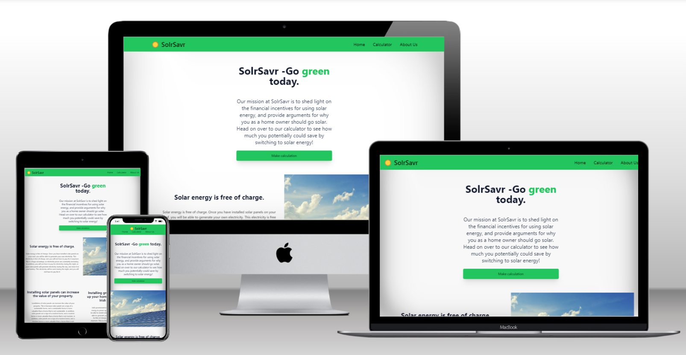
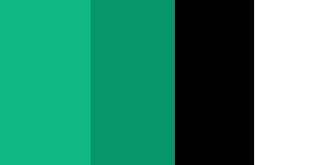
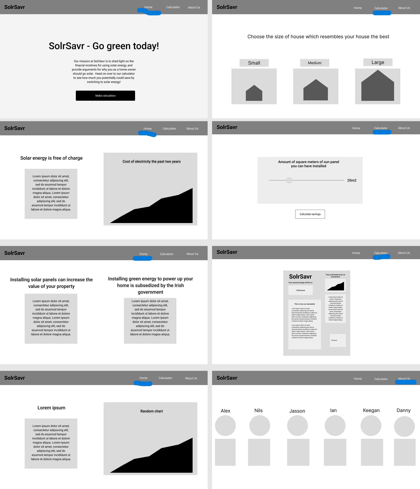

# Solr Savr
Solr Savr is a web app that allows users to calculate how much money they can save by installing solar panels on their homes. The app also provides information on the benefits of solar energy and how it can help the environment.

## Team Name: Solar Savrs

[Link to Deployed Project](https://solr-savr-u5cu.onrender.com)

<!-- ## Contents

* [Design](#design)
  * [Color Scheme](#color-scheme)
  * [Typography](#typography)
  * [Imagery](#imagery)
  * [Wireframes](#wireframes)
* [Deployment & Usage](#deployment)
* [Testing](#testing)
* [Credits](#credits)
  * [Code](#code)
  * [Content](#content)
  * [Media](#media)
  * [Acknowledgements](#acknowledgements) -->

## Programming Languages
* HTML - A mark-up language that uses semantic structures.
* CSS - Tailwind - Cascade style sheets are used to style the website.
* Javascript - Core programming language used for incorporating third-party libraries and client side webpage behaviour.

## Initial MVP idea:

We planned to create an app that would allow the user to see how much money they could save each year by getting solar panels installed on their homes. This would also include the amount of time it would take to make up for the installation fees for the solar panels. The calculations would be done taking in several factors such as the country, the energy costs per year in the selected country, the average solar energy produced per year, the type of home you have and the number of solar panels installed.

To be more attention grabbing welcoming we also wanted to create a home page with energy consumption facts and an About Us page for users to see who made the app.

## Color Scheme:

 
The colour scheme is a traditional light green and black. This fits the spirit and overall intentions of the app website to promote solar energy and lead to a greener Earth.

## Typography:
We used the default font for Tailwind CSS, which is the Inter font. This font is a sans-serif font that is easy to read and is very modern.

## Imagery:
Images in about page were taken from each user profiles in Slack channel.

Images in the home page were taken from pexels.com[https://www.pexels.com/]
  - Photo by Pixabay: https://www.pexels.com/photo/blue-solar-panel-board-356036/
  - Photo by Scott Webb: https://www.pexels.com/photo/low-angle-photography-of-high-rise-building-305833/

Images in the calculator page were taken from pngfind.com[https://www.pngfind.com/]
  - https://www.pngfind.com/download/ixwboTw_-house-clipart-cute-house-pink-houses-cottage/
  - https://www.pngfind.com/download/bioihm_house-png-clip-art-house-png-transparent-png/
  - https://www.pngfind.com/download/imRwwh_white-house-png-clip-art-clip-art-transparent/
## Wireframes:

Desktop Wireframes:

## Deployment
1. Clone the repository
2. Install dependencies
3. Create account in Render.com
4. Link GitHub repository to Render
5. Deploy

## Testing
Due to time constraints, we were unable to complete the testing of the app. However, we did test the app on a few devices and browsers to ensure that it was responsive and worked as intended.

## Acknowledgements
The Code Insitute Hackathon team for putting together this event.